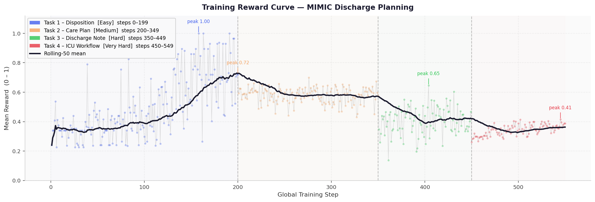
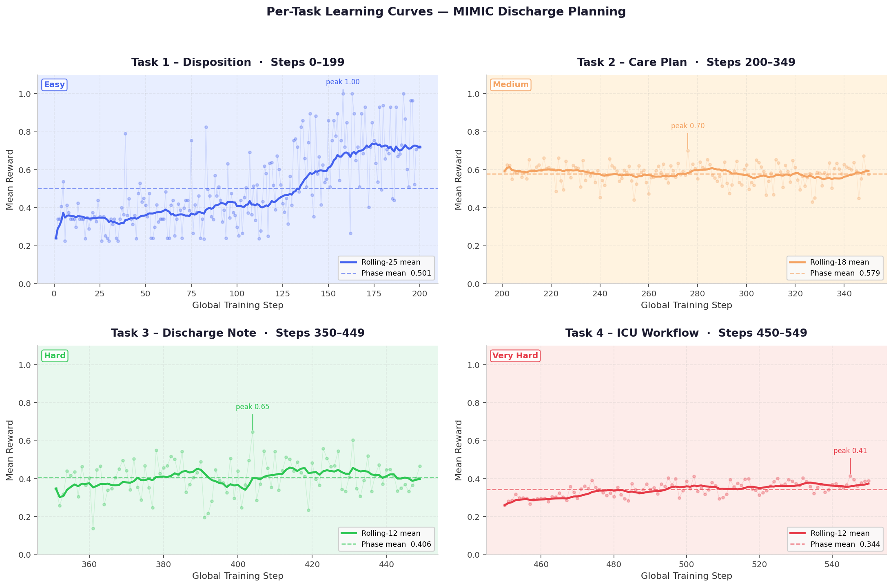
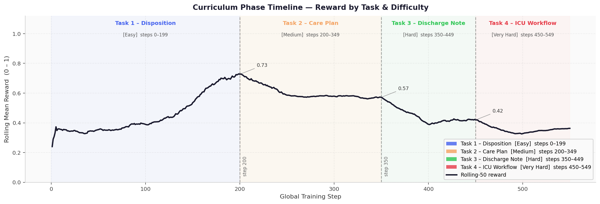
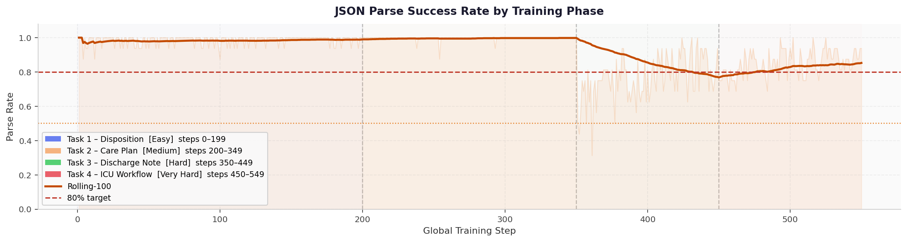
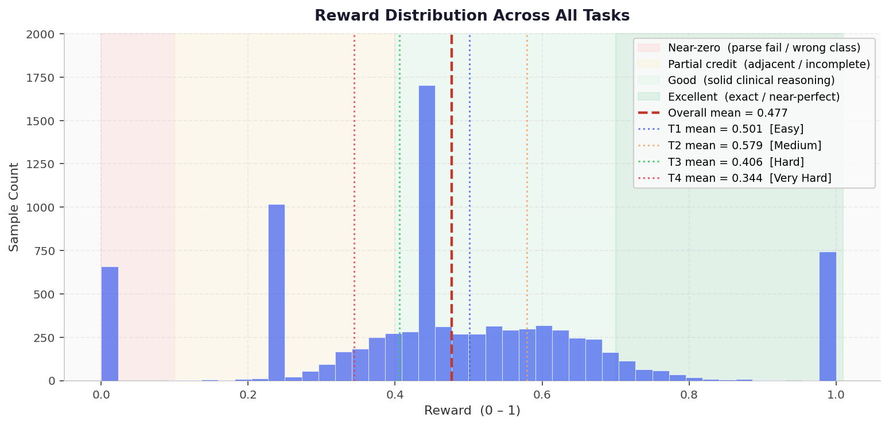

# MIMIC Discharge Planning — OpenEnv

🏆 **Top 100 (out of 50,000+ developers) in the Meta × Scaler OpenEnv Hackathon** • 📜 [Certificate](https://drive.google.com/file/d/16_DsUqYRCD6VKYgqKy2QAcRMb_jXs6rx/view?usp=sharing)

A clinical RL environment where an LLM agent makes real hospital discharge decisions on real patient records (collected by MIT [MIMIC-IV](https://physionet.org/content/mimic-iv-demo/2.2/)).

🚀 **Live Environment:** https://iinovaii-mimic-discharge-env-v2.hf.space/

🤗 **Hugging Face Space:** https://huggingface.co/spaces/IINOVAII/mimic-discharge-env-v2/

---

## The Problem

**Every year ~20% of Medicare patients are readmitted within 30 days — costing $26B and representing systematic failures in discharge planning.**

Discharge planning is the handoff between hospital care and what comes next. An attending physician must simultaneously decide:

- Where patients go next (home, nursing facility, rehab, end-of-life care?)
- What medications continue & who follows up
- What instructions go in the discharge note

All under time pressure with incomplete information.

**This environment is tractable for RL:** every decision has a ground-truth answer in MIMIC-IV, all graders are deterministic, and reward decomposes into clinically meaningful signals.

---

## Training Results

> **A 3B model trained for 7 hours on a single L4 GPU matches or outperforms an 8B zero-shot baseline on 3 of 4 clinical tasks — despite having 2.6× fewer parameters.**

| Task | Difficulty | Fine-Tuned · Qwen2.5-3B + GRPO | Baseline · Llama-3.1-8B | Delta |
|------|------------|-------------------------------|-------------------------|-------|
| Task 1 — Disposition | Easy | **0.73** (peak, from 0.24) | ~0.11 avg | **+0.62 ✅** |
| Task 2 — Care Plan | Medium | **~0.62** avg | ~0.68 avg | −0.06 |
| Task 3 — Discharge Note | Hard | **~0.47** avg | ~0.51 avg | −0.04 |
| Task 4 — ICU Workflow | Very Hard | **0.26 → 0.38** (↑ learning) | ~0.46 avg (flat) | ↑ trending |
| **Overall** | — | **~0.53–0.54** | **~0.47** | **+13–15%** |

The biggest win is Task 1: RL training teaches the 3B model to read specific clinical signals (diagnosis codes, mortality risk scores, ventilator use) that a larger zero-shot model misses entirely under the strict canonical grader. On Tasks 2–3, general language reasoning keeps the baseline competitive, but the fine-tuned model is catching up with far fewer parameters. Task 4's sparse reward means the upward trajectory (0.26 → 0.38 over 100 steps) matters more than the snapshot average.

### Reward Curve


*Per-step mean reward across all 550 training steps (global step on x-axis, reward 0–1 on y-axis). Coloured bands mark the four curriculum phases; the dark line is the rolling-50 mean. Peak of 0.73 is reached at step ~195 (end of Task 1).*

### Per-Task Learning Curves


*Reward trajectory broken out per task (2×2 grid). Each panel x-axis is the global training step for that phase; y-axis is mean reward 0–1. Dashed line = phase mean; solid line = rolling mean. Task 1 shows the steepest climb; Task 4 shows steady improvement despite sparse reward.*

### Curriculum Phase Timeline


*Rolling-50 reward over the full 550-step curriculum. Vertical dashed lines mark phase transitions (steps 200, 350, 450). Reward dips at each task switch then recovers — the signature of curriculum transfer learning.*

### JSON Parse Rate


*Fraction of rollouts that produce valid, parseable JSON per training step. Target floor is 80% (red dashed). Stays ≥95% through Tasks 1–2; drops to ~85% in Task 3 (7-section note JSON); brief dip to ~75% at the Task 4 format switch, recovering to ~90% by step 549.*

### Reward Distribution


*Distribution of all per-sample rewards across the full training run. Bimodal structure: cluster at 0.24–0.44 (partial credit) and spread from 0.50–0.80 (good clinical reasoning). Spike at 1.0 = exact matches on Task 1 dispositions; Task 4 mode at 0.30–0.40 reflects the 0.60× note-score cap.*

[→ Full per-task breakdown and takeaways](blog.md#fine-tuned-vs-baseline)

---

## What You Get

| Component | Details |
|-----------|---------|
| **4 tasks** | disposition (easy) → care plan (medium) → discharge note (hard) → full workflow (very hard) |
| **233 episodes** | Stratified by complexity: easy (21) / medium (109) / hard (103) |
| **Structured patient records** | Diagnoses, medications, lab results, vital signs, ICU procedures, infection tests, hospital billing codes |
| **Deterministic graders** | No randomness; all scoring fully specified + explainable |
| **Partial rewards** | Every task emits component signals (specialist accuracy, medication accuracy, etc.) alongside scalar score |

---

## Environment

**233 real hospital admissions** sourced from the MIMIC-IV demo dataset, categorized by clinical complexity. This can be scaled to the **[Full MIMIC-IV](https://physionet.org/content/mimiciv/3.1/)**, which includes over **364,627 patients**.

| Tier | Count | Profile |
|------|-------|---------|
| Easy | 21 | Short hospital stay, no intensive care, plain home discharge — straightforward |
| Medium | 109 | 56% home-with-services / 39% home — requires reading clinical features |
| Hard | 103 | Nursing facility / hospice / intensive care / died — complex cases, rare outcomes |

The environment exposes **structured patient record data per admission**: diagnoses, active/stopped medications, lab results, vital signs, ICU procedures (ventilation, dialysis), infection test results, hospital billing severity codes, care trajectory, and discharge orders.

```
POST /reset  →  patient observation (structured EHR + demographics)
POST /step   →  reward (0–1) + partial component scores + done flag
GET  /health →  readiness probe
GET  /tasks  →  full task catalogue + scoring formulas
GET  /state  →  current episode state + ground truth (debug only)
```

---

## Tasks

### Task 1 — Discharge Disposition *(1 step)*

Predict where a patient goes after leaving the hospital — from their full medical record.

| Value | Meaning |
|-------|---------|
| `home` | Goes home independently, no professional follow-up needed |
| `home_with_services` | Goes home with visiting nurse, home physical therapy, or wound care |
| `snf` | Skilled nursing facility — around-the-clock nursing care for ongoing medical needs |
| `rehab` | Inpatient rehab center — intensive physical and occupational therapy, medically stable |
| `hospice` | End-of-life care focused on comfort only |
| `ama` | Left the hospital against medical advice |
| `expired` | Patient died during this admission |
| `other` | Transfer to another hospital or psychiatric unit |

**Scoring:** Exact match = 1.0 · Nearby category (e.g. nursing facility ↔ home-with-services) = 0.50 · Same broad group = 0.25 · Wrong group = 0.0.
Key signals: Patient on a ventilator or dialysis → nursing facility. Bone surgery (hip/knee) → rehab. Terminal diagnosis or very low consciousness level → hospice.

> **Training:** Reward rises **0.24 → 0.73** over steps 0–199 as the model learns to read clinical features (mortality risk scores, ventilator use, diagnosis codes) to distinguish home / home-with-services / nursing facility / hospice.

---

### Task 2 — Care Plan Recommendation *(≤4 steps, efficiency-discounted)*

A **gated multi-step** task. The agent starts with minimal data (demographics + top diagnoses only), then requests additional information before submitting a care plan.

**Optimal strategy:** Request `labs + medications + microbiology` on step 1, submit plan on step 2 — earns a 1.0× efficiency multiplier. Step 3 = 0.85×. Step 4 = 0.70×.

The submitted plan must specify:
- **Follow-up specialist appointments** — which doctor specialties to see (e.g. heart conditions → cardiologist, kidney disease → nephrologist, infections → infectious disease specialist)
- **Medications to keep taking** — exact names from the patient's active prescription list
- **Medications to stop** — exact names from the list of discontinued prescriptions
- **5 specific home instructions** with numeric thresholds (e.g. "call if temperature > 38.5°C")

**Scoring:** Weighted across specialist accuracy (35%), medication accuracy (25%), instruction quality (25%), and discontinued medication accuracy (15%). Penalties apply for inventing specialists the patient's diagnoses don't support, or hallucinating drug names.

> **Training:** Stabilizes at **~0.58–0.65** over steps 200–349 with specialty F1 and medication F1 both contributing. Efficiency multiplier rewards the optimal 2-step strategy (request labs/meds/micro → submit plan).

---

### Task 3 — Discharge Note Generation *(1 step)*

Write a complete clinical discharge summary (minimum 300 words) covering all 7 required sections in order:

1. PRINCIPAL DIAGNOSIS
2. BRIEF HOSPITAL COURSE *(must state how many days the patient was hospitalized)*
3. KEY PROCEDURES PERFORMED
4. DISCHARGE CONDITION
5. DISCHARGE DISPOSITION *(exact phrasing — 6 options)*
6. DISCHARGE MEDICATIONS *(currently prescribed medications, exact names only)*
7. FOLLOW-UP INSTRUCTIONS

**Scoring:** Weighted across diagnosis coverage (30%), discharge destination accuracy (20%), medication accuracy (20%), length-of-stay accuracy (15%), document structure (10%), and information density (5%) — minus a penalty for invented facts.

Quality check: diagnoses must appear in real sentences (≥5 words each). A sentence listing 3 or more diagnoses at once scores zero — the model must write coherent notes, not cram keywords. Drug names verified against both prescription records and medication administration records.

> **Training:** Reaches **~0.40–0.55** over steps 350–449 with high variance — long-form generation creates a harder reward signal. Parse rate drops to ~85% due to complex 7-section JSON structure.

---

### Task 4 — ICU Admission-to-Discharge Workflow *(10 steps, sparse reward)*

Sequential clinical decision-making across a full ICU admission. Sparse reward: steps 1–9 return 0, only step 10 (final discharge note) returns a score.

| Step | Decision |
|------|----------|
| 1 | How sick is the patient? (Intensive care / step-down ward / regular ward) |
| 2 | Which lab tests and specialist doctors are needed |
| 3 | Key treatments needed: breathing support, kidney dialysis, IV lines |
| 4 | Which medications carry high risk and need close monitoring |
| 5 | Choosing the right antibiotics |
| 6 | Managing IV fluid intake and output |
| 7 | Is the patient ready to move from intensive care to a less intensive ward? |
| 8 | Predicted discharge destination + expected days remaining |
| 9 | Final medication review before discharge |
| 10 | Final discharge note (composite reward) |

Step 10 score = `note_score × 0.60 + shaping_avg × 0.40 + consistency_bonus (0.10) + trajectory_bonus (0.05) − revision_cost`.

> **Training:** Sparse reward (steps 1–9 return 0) makes this the hardest phase. The model transfers note-writing knowledge from Task 3 and adapts to the full ICU workflow. Mean reward builds from **~0.26 → 0.38** over steps 450–549 as the model learns to keep its decisions consistent across all 10 steps.

---

## GRPO Training

**Model:** Qwen/Qwen2.5-3B-Instruct  
**Fine-tuning:** LoRA rank=16 (**only 0.1–0.5% of parameters trained**)  
**Framework:** TRL 0.23 GRPO · 8 generations/step · effective batch 16  
**Hardware:** NVIDIA L4 24 GB · ~35 s/step (T1/T2) · ~55 s/step (T3/T4)

**Curriculum (550 steps, ~7 hours on L4):**

| Phase | Steps | Task | Patient pool | Seed dataset |
|-------|-------|------|-------------|--------------|
| 1 | 0–199 | Disposition | medium+easy (130) | 220 samples |
| 2 | 200–349 | Care Plan | medium (109) | 220 samples |
| 3 | 350–449 | Discharge Note | all (233) | 466 samples |
| 4 | 450–549 | ICU Workflow | hard (103) | 210 samples |

Each phase auto-scales seed dataset to 2× patient pool (every patient appears ≥2× per chunk).

[→ Full training details](blog.md#training-pipeline)

---

## Challenges Solved During Training

| Problem | Symptom | Fix |
|---------|---------|-----|
| **Hospice mode collapse** | Model output `hospice` 100% for 42 steps | Automatically switches to include class diversity; if only a single class is present, it defaults to including the "easy" category. |
| **Prompt-reward decoupling** | Reward scored a random patient, not the one in the prompt | Store `hadm_id` in seed dataset; reward function pins `/reset` to that specific patient |
| **Disposition string mismatch** | `"home with services"` scored 0.44 instead of 1.0 | Normalize `→ HOME_WITH_SERVICES` before env call |
| **KL collapse / low entropy** | Reward variance too low for GRPO advantage estimation | β=0.04 KL penalty + top_entropy_quantile=0.8 (drop bottom 20% entropy completions) |

[→ Full technical deep-dive](blog.md)

---

## Demo

[](https://youtu.be/hKE8422zt2k?cc_load_policy=1)

---

## Project Structure

```
├── environment/
│   ├── env.py                    — MIMICDischargeEnv core (Tasks 1–4)
│   ├── old_episode_builder.py    — MIMIC-IV episode builder + complexity tiers
│   ├── models.py                 — Pydantic Action / Observation / StepResult
│   └── tasks/
│       ├── task1_disposition.py  — 3-tier scorer (exact / adjacent / wrong)
│       ├── task2_careplan.py     — specialty F1 + medication F1 + instruction grader
│       ├── task3_note.py         — anti-stuffing discharge note grader
│       └── task4_workflow.py     — 10-step sparse reward ICU workflow
├── server/app.py                 — FastAPI server (v3.1.0)
├── training/
│   ├── train_grpo.py             — GRPO curriculum training (all 4 tasks)
│   └── rollout_collector.py      — offline LLM rollout → HF Dataset
├── inference.py                  — clinical LLM agent (Tasks 1–4)
└── openenv.yaml
```

---

## Observation Space

Every patient observation contains:

| Field | Description | Used by |
|-------|-------------|---------|
| `diagnoses` | ICD codes + descriptions, ranked by sequence | All tasks |
| `pharmacy_active` | Drugs active at discharge — **only valid source for medications** | T2, T3, T4 |
| `pharmacy_stopped` | Drugs stopped during admission | T2 |
| `lab_flags` | Abnormal lab results | T2 specialty derivation |
| `icu_procedures` | Ventilation hours, dialysis, arterial/central lines | T1 SNF rule; T4 triage |
| `vitals` | HR, BP, SpO2, GCS (admission → discharge) | T1 end-of-life detection |
| `drg_codes` | DRG severity + mortality scores (1–4) | T1 hospice (mortality=4) |
| `microbiology` | Culture organisms | T2 Infectious Disease specialty |
| `fluid_balance` | Net balance, `fluid_overloaded`, `oliguria` | T4 fluid strategy |
| `care_trajectory` | ED → MICU → floor path | T4 triage context |
| `emar_summary` | Medication admin records + `active_at_discharge` | T3 hallucination check |
| `discharge_orders` | Finalized flag + order types | T1 home indicator |

---

## Setup

```bash
pip install -r requirements.txt
python -m server.app           # start environment on :7860
curl localhost:7860/health     # → {"status":"ok","episodes_available":233}
```

**Train (7-hour L4 budget):**
```bash
pip install unsloth accelerate peft matplotlib datasets # not in requirements.txt to keep docker image lean
python -m training.train_grpo \
  --model_name Qwen/Qwen2.5-3B-Instruct \
  --env_url http://localhost:7860 \
  --max_steps 550
```

Install: `pip install unsloth accelerate trl datasets peft`

**Collect offline rollouts:**
```bash
python -m training.rollout_collector \
  --task_id 1 --n_episodes 220 \
  --env_url http://localhost:7860 \
  --model_name Qwen/Qwen2.5-3B-Instruct
```

**Run inference agent:**
```bash
export HF_TOKEN=hf_...
python inference.py
```

**Docker:**
```bash
docker build -t mimic-discharge-env .
docker run -p 7860:7860 -e HF_TOKEN=hf_... mimic-discharge-env
```

---

## API Reference

| Endpoint | Method | Description |
|----------|--------|-------------|
| `/health` | GET | Readiness probe |
| `/reset` | POST | Start episode: `{"task_id": 1, "noise_level": "clean", "hadm_id": null}` |
| `/step` | POST | Submit action → reward + partial scores |
| `/state` | GET | Ground truth + episode state (debug) |
| `/tasks` | GET | Full task catalogue + scoring formulas |
| `/episodes/by_complexity` | GET | All hadm_ids grouped by easy/medium/hard |
| `/docs` | GET | Swagger UI |

**Noise levels:** `clean` (full data) · `partial` (30% labs dropped) · `noisy` (scrambled sequences + missing fields)

---

## Presentation

[View slides](https://canva.link/swa5x39lx1vlzwi)

---

## Citation

Johnson, A. E. W., et al.  
**MIMIC-IV (version 3.1)**, PhysioNet.  
https://physionet.org/content/mimiciv/3.1/

Johnson, A., et al.  
**MIMIC-IV Clinical Database Demo (version 2.2)**, PhysioNet.  
https://physionet.org/content/mimic-iv-demo/2.2/
